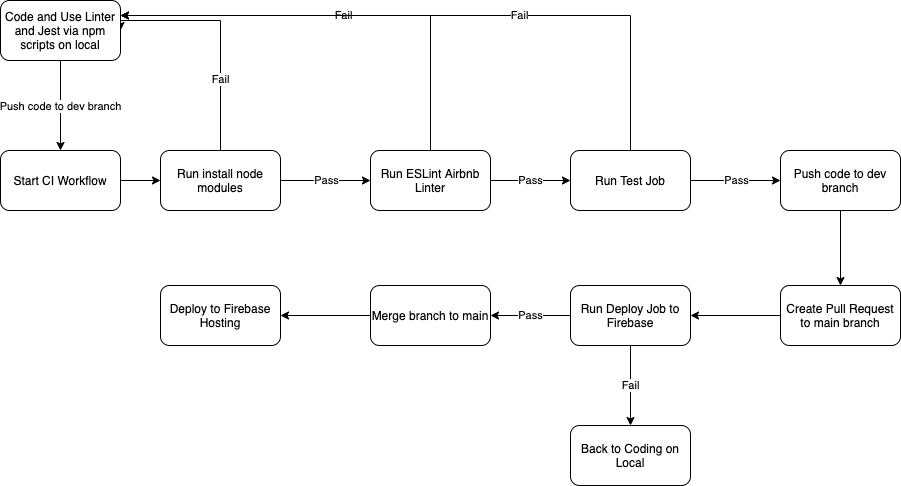

# Current Status of CI Pipeline



Above: diagram of planned CI Pipeline
## Before Pushing to the Remote Repository

Before even pushing to any of the remote development branches, the following scripts should be run by each member who wishes to push to the remote repository:

```unit-tests: npx jest --coverage```

```lint: npx eslint . --ext .js```

```lint-fix: "npx eslint --fix . --ext .js```

- `unit-tests`: runs all unit tests that have been written up and produces a coverage report after completion of those tests.
- `lint`: runs airbnb linter via eslint and gives warning and errors where styling and code conventions are not to standard.
- `lint-fix`: very similar to `lint`, except that running this script will have the linter automatically fix any styling problems that can be fixed automatically for the developer.

Each team member is responsible for checking that these scripts pass locally for their current code before they push to the remote. These tests will be run again during the build process.

## Build Job

Upon pushing to the remote repository, the build job under Github actions will be run. This job will run checks on the installation of the npm packages and dependencies used on Ubuntu and Windows machines and also run style checks using the airbnb linter as well as running unit tests. 

Code is only to be pushed to the current remote branch if the entire build job passes.

## Merging to main (Production)

When ready to merge to the main branch and deploy to production, there needs to be at least one other person to approve of the pull request before it can officially be merged. Integration tests should also be run at this point to ensure that the new code will not break the application when deployed. If the integration tests pass, then the code is merged and deployed to firebase automatically.

Things that are done:
- local scripts to check code quality (linting, unit testing)
- build job via Github actions
- approval of merge requests to main

Things that still need to be done:
- jobs to run end to end tests
- job to deploy to firebase after merge to production